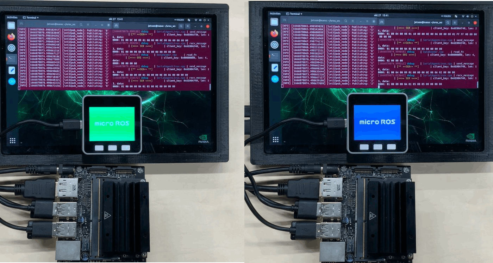

# micro_ros_packages

This is a micro-ros package using Teensy or M5Stack.



## Supported ROS 2 distributions

[![humble][humble-badge]][humble]
[![ubuntu22][ubuntu22-badge]][ubuntu22]

## Requirements
- Ubuntu OS PC
  - Ubuntu 22.04 Humble

## How to use

### teensy_uros/teensy_uros.ino

This is a multi-topic publisher program using Teensy.

```sh: Leader terminal
cd ~/uros_ws
. install/setup.bash
ros2 run micro_ros_agent micro_ros_agent serial --dev /dev/ttyACM0 -v6
```

### uros_fsr_publisher/uros_fsr_publisher.ino

This is a FSR topic publisher program using M5Stack.

```sh: Leader terminal
cd uros_ws/
. install/setup.bash
ros2 run micro_ros_agent micro_ros_agent serial --dev /dev/ttyUSB0 -v6
```

### uros_subscriber/uros_subscriber.ino

This program switches the M5Stack screen with data received from the ROS 2 Humble Laptop PC.

It receives std_msgs__msg__Int32 msg and switches the screen.

### uros_foxy_subscriber/uros_foxy_subscriber.ino

This program switches the M5Stack screen with data received from the ROS 2 Foxy Jetson Nano.

It receives std_msgs__msg__Int32 msg and switches the screen.

## References

[ROS2: Ubuntu22.04にArduino, Teensy, micro-rosの環境を準備する](https://zenn.dev/tasada038/articles/7192b002e6c271)

[micro-ROS-arduino: JetsonとM5Stackで通信する](https://zenn.dev/tasada038/articles/83d78c8a8a3916)


## License
This repository is licensed under the MIT license, see LICENSE.

[humble-badge]: https://img.shields.io/badge/-HUMBLE-orange?style=flat-square&logo=ros
[humble]: https://docs.ros.org/en/humble/index.html

[ubuntu22-badge]: https://img.shields.io/badge/-UBUNTU%2022%2E04-blue?style=flat-square&logo=ubuntu&logoColor=white
[ubuntu22]: https://releases.ubuntu.com/jammy/

